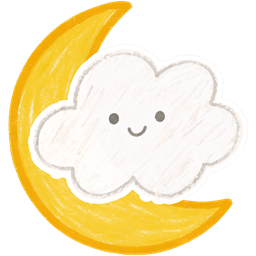

**A friendlier dashboard for BigSky (D2L Brightspace) at De La Salle-CSB.**

 

by <a href="https://github.com/Nyrrine"><b>@Nyrrine</b></a> · BS Information Systems · DLS-CSB

  

---

## What it does

BigSky (Benilde's D2L Brightspace) is functional but harsh — eight clicks to find what's due, no glance-able view of new announcements, no cross-course search, and an interface that hasn't been updated in years.

**SmallSky** is a Chrome extension that reads from BigSky's own APIs and renders it as a soft, calm dashboard. Built specifically for Benilde students.

It's not a replacement for BigSky — submissions, content viewing, quizzes still happen on BigSky itself. SmallSky is the *home page*, the *agenda view*, the *finder*.

## Features

- **Up Next** — the four most urgent unsubmitted assignments and quizzes, with real submission detection.
- **My classes** — a tile grid for every course you're enrolled in. Pin to top, hide admin courses, upload custom photos. Click a tile to see modules / weeks / recent announcements without leaving the dashboard.
- **What's new** — recent announcements with inline expand. Mark-as-read tracked locally.
- **Schedule** — full month calendar of every dated event across all your courses, with a day-by-day agenda. Submitted assignments are dimmed; missed ones are flagged.
- **Cross-course search** — press <kbd>/</kbd> to fuzzy-search announcements, modules, assignments, and quizzes — instant, no extra fetches.
- **Background sync + Chrome badge** — service worker pings BigSky every 5 minutes; toolbar icon shows count of items due in 48 hours.
- **Light / dark theme** — circle-reveal animation between modes.
- **Per-assignment notes** — local-only scratchpad on every Up Next card.
- **Auto-open SmallSky** — optional: BigSky's `/d2l/home` redirects to SmallSky.

## Who made this

I'm **Joaquin Bryan G. Ross**, a BS Information Systems student at **De La Salle-College of Saint Benilde** (ID 125). SmallSky started as a personal project because I genuinely couldn't stand opening BigSky every morning — clicking through five tabs just to see what was due felt absurd when the data was right there in the API the whole time. I thought, *I'm a Benilde student too — if it makes my life calmer, maybe it'll make yours calmer.* So I built it for us.

**Why you can trust it:**

- I'm an actual Benilde student. You can verify the project author through my GitHub profile ([@Nyrrine](https://github.com/Nyrrine)) and the disclaimers in this repo.
- **All code is open and readable** in this repository. There's nothing hidden — no minified bundle, no obfuscated calls. Browse `dashboard.js`, `lib/api.js`, and `background.js` to see exactly what the extension does.
- **Nothing leaves your browser.** No analytics, no telemetry, no server I run. The extension only talks to BigSky using the session cookie that's already in your browser. See the [Privacy](#privacy) section below.
- **The only permissions the extension requests** are listed in [`manifest.json`](manifest.json) — `storage` (to cache + remember your prefs), `alarms` (for 5-minute background sync), `unlimitedStorage` (to hold custom course photos), and access to `bigsky.benilde.edu.ph` (the BigSky API).
- **SmallSky is unofficial** and I'm a student maintaining it in my spare time. The [LICENSE](LICENSE) is explicit: always verify anything that matters (grades, deadlines, submissions) on BigSky itself before relying on it for graded work. SmallSky is a convenience layer, not your source of truth.

Found a bug, want a feature, or just to say hi? [Join the Discord](https://discord.gg/DTvRR5qxxh) or [open an issue](https://github.com/Nyrrine/smallsky/issues). I'm one person — replies may take a day or two.

## Install

### 🌥️ First time installing a Chrome extension? Start here

> If you've never installed a Chrome extension manually before, the steps below can feel intimidating. Don't worry — **[join the Discord](https://discord.gg/DTvRR5qxxh)** for a beginner-friendly step-by-step picture guide. Walks you through every click with screenshots. Takes about 2 minutes.

### Install (for developers / comfortable users)

1. Click `Code` → `Download ZIP` (or `git clone https://github.com/Nyrrine/smallsky.git`).
2. Unzip the folder.
3. Open Chrome and navigate to `chrome://extensions`.
4. Toggle **Developer mode** on (top-right corner).
5. Click **Load unpacked** and pick the unzipped folder.
6. Pin the SmallSky icon to your toolbar.
7. Log into BigSky in any tab — then click the icon.

## Updates

SmallSky checks for new versions once a day. When one's out, you'll see a soft banner at the top of the dashboard with a "See what's new" button — click it for the changelog and a 1-minute update guide.

If you dismiss a version, you won't be nagged about it again. The next version will pop up its own banner.

## Privacy

- SmallSky runs entirely in your browser. **Nothing leaves your device.**
- It reads from BigSky's APIs using your existing session cookies — the same way the BigSky web UI does.
- Cached data, custom photos, notes, and preferences all live in `chrome.storage`, scoped to your browser profile.
- No analytics, no telemetry, no external servers.

## Accessibility — a work in progress

SmallSky should be usable by every Benilde student, but I know it isn't there yet. I built it primarily as a sighted, mouse-using student myself, which means there are gaps I can't see from where I sit.

**If you're a student who uses any of the following — please reach out so I can make SmallSky work better for you:**

- A screen reader (NVDA, JAWS, VoiceOver, TalkBack)
- Keyboard-only navigation
- High-contrast mode, larger text, or zoom
- Reduced motion / vestibular sensitivity
- Voice control, switch access, or other assistive tech
- Anything else that the dashboard currently makes harder for you

The goal isn't to assume what helps — it's to ask. Tell me what doesn't work, what would, and I'll prioritize it. Reach out on [Discord](https://discord.gg/DTvRR5qxxh), [open an issue](https://github.com/Nyrrine/smallsky/issues), or DM me directly on Discord. No request is too small.

---

## Tech (deep dive)

For curious devs and contributors. Casual users can stop reading here — everything above is enough to install and use SmallSky.

- Manifest V3 Chrome extension. Vanilla ES modules — no build step.
- Service worker for background sync (`chrome.alarms`).
- `chrome.storage.local` for caches (TTL'd, stale-while-revalidate). `chrome.storage.sync` for preferences (pins, hides, settings).
- Submission detection scrapes one D2L HTML endpoint (`dropbox/user/folders_list.d2l`) because the Valence API gates per-student submission state behind instructor permission.
- See [`CONTRIBUTING.md`](CONTRIBUTING.md) for the code layout, conventions, and where help is wanted.

## License

[MIT](LICENSE), with a disclaimer that SmallSky is unofficial and may show inaccurate data — always verify on BigSky itself before relying on it for graded work.
